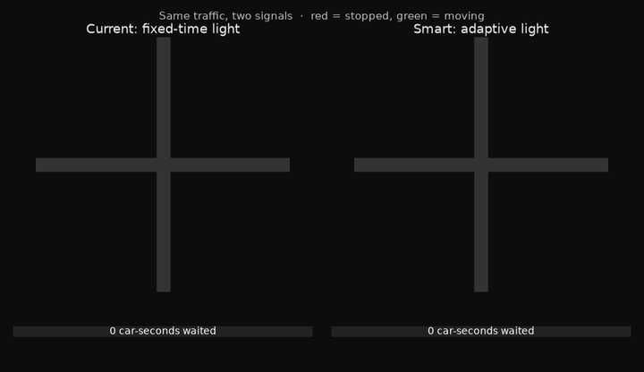
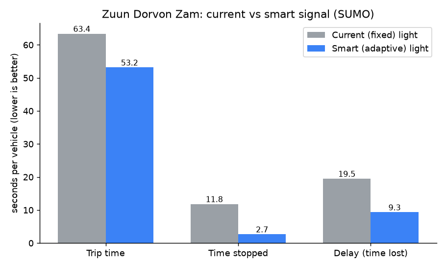
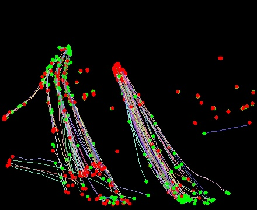

# Traffic Vision → Simulation

Turn ordinary traffic-camera video into a **calibrated traffic simulation** — and test whether changing the signals would actually reduce the jam.

I built this end-to-end while learning computer vision, using a notoriously congested intersection in Ulaanbaatar (Зүүн дөрвөн зам, "Four Roads") as the case study.



> The SUMO model: the **same traffic** under today's fixed-time light (left) vs a smart adaptive light (right). Each dot is a vehicle coloured by speed (red = stopped, green = moving); the bar under each side tracks total waiting. The pipeline behind it: detect & track with YOLO11 → count throughput → calibrate demand from counts → simulate signal changes.

## The finding

A first-cut simulation suggests that switching this junction from a **fixed-time** signal to a **vehicle-actuated (adaptive)** one would cut average delay by roughly **half** — and the result held across three independent ways of estimating demand (−52% to −61%).



## How it works

```
video ──► YOLO11 + ByteTrack ──► line-crossing counts ──► O-D calibration ──► SUMO ──► test fixes
        (detect + track)        (throughput/direction)   (routeSampler)    (simulate)
```

1. **Detect + track** — a pretrained YOLO11 model (no training from scratch) finds cars/buses/trucks; ByteTrack keeps a stable ID on each across frames.
2. **Count** — counting lines on each approach tally crossings and direction (pure geometry: does the vehicle's path cross the line?).
3. **Calibrate demand** — rather than trusting fragile per-vehicle journey tracking on low-res video, the turn ratios are *inferred from the trusted line counts* using SUMO's `routeSampler` (the standard "O-D from link counts" technique). Matched 88% of counts at GEH<5.
4. **Simulate** — [SUMO](https://eclipse.dev/sumo/) recreates the junction and runs the same vehicles under different signal logic, measuring per-vehicle delay.



*Every tracked vehicle's path over ~100 s (derived trajectory data) — used to place the counting lines on the real flow.*

## What I learned (the non-obvious parts)

- **Record, then process.** Live tracking on CPU drops frames; the tracker loses IDs and counts come out near zero. Recording first, then processing every frame, fixes it.
- **Resolution beats model size.** On distant tiny cars, `yolo11n` at 960px detected *more* vehicles than `yolo11m` at 640px — and faster.
- **Don't pretend the video is sharper than it is.** Per-vehicle O-D from a single low-res camera is detection-range biased; inferring turns from trusted counts is more honest and more accurate.

## Tech stack

[Ultralytics YOLO11](https://github.com/ultralytics/ultralytics) · ByteTrack · OpenCV · [Eclipse SUMO](https://eclipse.dev/sumo/) · Python

## Limitations (read before trusting the numbers)

- Based on a **single 5-minute sample** that happened to span a jam clearing — not a steady-state average.
- The SUMO geometry is an **idealized 4-arm cross**, no pedestrians or bus stops modelled.
- Camera is **480p / 7 fps** — good for aggregate/relative analysis, not precise per-vehicle facts.
- Findings are **indicative, not a traffic-engineering study.** The *direction* of the result (adaptive helps lopsided demand) is robust; the exact magnitude is approximate.

## Running it on your own footage

This repo runs on **any traffic video you have the rights to** — a recorded clip or an HLS URL you're permitted to use:

```bash
pip install ultralytics opencv-python eclipse-sumo
python count.py your_clip.mp4 yolo11n.pt 960     # throughput + direction
# then build/calibrate the SUMO model in sumo/
```

> **Note on data source:** the camera-discovery/scraping code is intentionally **not** included, to respect the source site's terms. Point the tools at your own footage.

## Credits

Simulation: Eclipse SUMO. Detection: Ultralytics YOLO. Maps: Leaflet + OpenStreetMap. Built as a learning project — feedback welcome.
